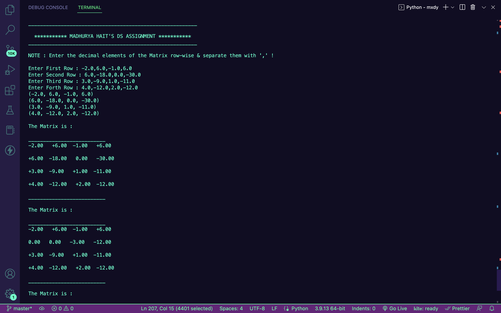
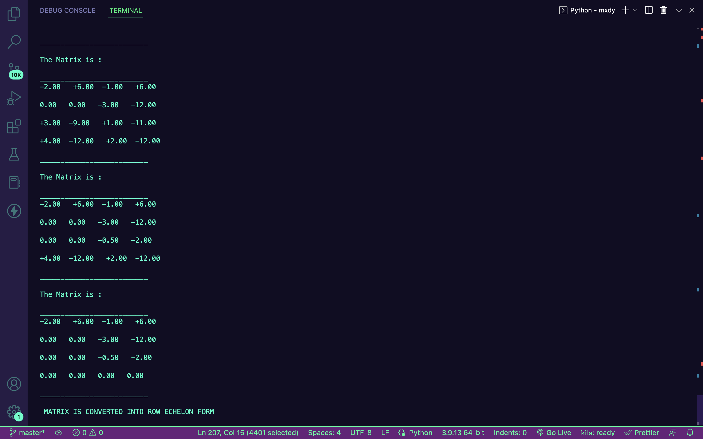

# Row-Echelon

<h1>What Is Row Echelon Form</h1>

A matrix being in row echelon form means that Gaussian elimination has operated on the rows, and column echelon form means that Gaussian elimination has operated on the columns. In other words, a matrix is in column echelon form if its transpose is in row echelon form. Therefore, only row echelon forms are considered in the remainder of this article. The similar properties of column echelon form are easily deduced by transposing all the matrices. Specifically, a matrix is in row echelon form if:
 
1. All rows consisting of only zeroes are at the bottom.
 
2. The leading coefficient (also called the pivot) of a nonzero row is always strictly to the right of the leading coefficient of the row above it.

<h3>This is the output of the python program : </h3>

